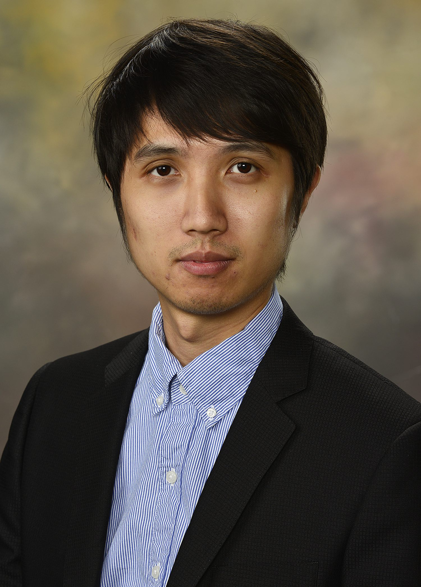

###  PI

    

        

                 
        

    

Li Chen, Principal Investigator 

 

###  PhD students 

Fengdi Zhao, PhD student in Biostatistics (2021-now), BS University of Washington, MS University of North Carolina

Xin Ma, PhD student in Biostatistics (2022-now), BS Southwestern University of Finance and Economics， MS George Washington University

Weijia Jin, PhD student in Biostatistics (2023-now), BS Peking University, MS University of Michigan

Zhang Yutao, PhD student in Biostatistics (2024-now), BS Harbin Engineering University, MS University of Florida

Wenxing Wang, PhD student in Biostatistics (2025-now), BS The Hong Kong Polytechnic University, MS Yale University

Yuhan Wang, PhD student in Biostatistics (2025-now), BS Shanghai University of Finance and Economics, MS Columbia University (co-advisor Dr. Taki Benos)

 

###  MS students 

 

###  BS students 

Javlon Nizomov, BS of Public Health

 

## Alumni

###  PhD

<li> <strong>Ye Wang</strong>, PhD in Computer Science at Auburn University, 2021. 
<strong>Current position</strong>: Research Scientist at Biogen. </li>
    
###  MS

<li> <strong>Gaoxiang Li</strong>, MS in Computer Science at Auburn University, 2020. 
<strong>Current position</strong>: Ph.D. student in the Department of Computer Science, Texas Tech University. </li>

<li> <strong>Toluwanimi Shorinwa </strong>, MS in Purdue University, 2023. 
<strong>Current position</strong>: Electronics System Engineer at Ummins </li>

###  Research Assistant

<li> <strong> Sai Ritesh Thela</strong>, MS student in Computer Science at UF, 2024.
<strong>Current position</strong>: PhD student in Department of Computer Science, Arizona State University. 

<li> <strong> Javlon Nizomov</strong>, BS of Public Health at UF, 2024.
<strong>Current position</strong>: Head Engineer at Linex Interactive.  

<li> <strong>Aman Agarwal</strong>, MS in Computer Science at Indiana University, 2023. 
<strong>Current position</strong>: R&D Engineer at Synopsys.  
    
<li> <strong>Ziqian Bi</strong>, MS in Computer Science at Indiana University, 2021. 
<strong>Current position</strong>: Ph.D. student in the Department of Computer Science, Indiana University.  

<li> <strong>Uma Maheswari Gollapudi</strong>, MS in Computer Science at Indiana University, 2021. 
<strong>Current position</strong>: Data Scientis at Oracle. 
    
<li> <strong>Chao Li</strong>, PhD in Pharmaceutical Sciences at Auburn University, 2021. 
<strong>Current position</strong>: Data Scientist at AbbVie. </li>

